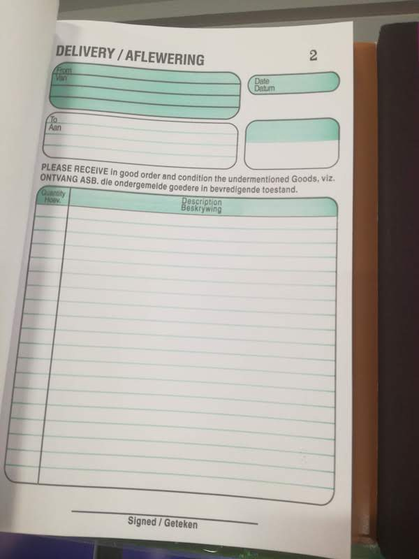

# A study of forms

I was browsing my local stationary shop and came across a section with books of forms. There is something about them that I love. Paper based forms have been a part of business and life ever since pen and paper were invented. I think software developers like myself could learn a lot about design from these old forms.

## DELIVERY / AFLEWERING

[Open form](https://practical-snyder-46e47c.netlify.com/delivery.html)

